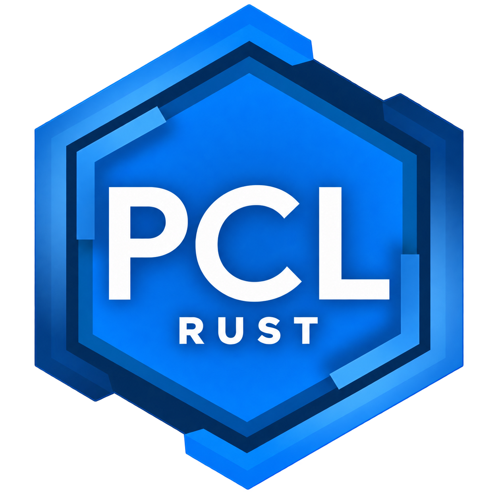

<p align="center">
  
</p>
<h1 align="center">PCL Rust</h1>

<p align="center">
  <a href="https://github.com/mohui666/PCL-Rust/actions/workflows/build.yml"></a>
  
  
  
</p>

<p align="center">
  <a href="#快速运行">运行当前版本</a> · <a href="docs/README.md">文档</a> · <a href="docs/migration-matrix.md">迁移进度</a> · <a href="docs/validation.md">验证记录</a>
</p>

由 **[mohui666](https://github.com/mohui666)** 开发的第三方 Minecraft 启动器，以 Rust 重构 PCL，提供 **macOS、Windows 与 Linux x86_64** 构建。界面以 Windows 官方 **PCL 2.13.1.1** 为基准，macOS 本地构建使用苹方。

[下载 v0.1.1](https://github.com/mohui666/PCL-Rust/releases/tag/v0.1.1)：提供 Windows x86_64、macOS Apple Silicon 和 Linux x86_64 安装包，已配置 Microsoft App ID 与 CurseForge 应用 Key，恢复离线登录并修复皮肤、菜单及任务历史布局。无需用户手动填写服务 Key。

## 功能

| 模块 | 支持内容 |
| --- | --- |
| 安装与资源 | Minecraft、加载器、Java 管理，Modrinth / CurseForge，整合包导入导出（可附三端启动器），Mod 更新 |
| 启动与维护 | 全局与版本独立设置，微软正版账号与皮肤，游戏进程、日志与崩溃分析；支持离线登录与离线皮肤 |
| 下载与任务 | 下载源、限速、哈希校验，冲突排队，最多 4 路独立任务，取消、重试与加权进度 |
| 个性化 | 主题、背景 / GIF、音乐，自定义 XAML 主页、帮助文档与页面动画 |

具体加载器、整合包格式和 XAML 支持范围见[迁移矩阵](docs/migration-matrix.md)。

## 快速运行

普通用户从 [Release 下载页](https://github.com/mohui666/PCL-Rust/releases/tag/v0.1.1)选择对应平台，解压后运行 `PCL-Rust.exe`、`PCL Rust.app` 或 `./PCL-Rust`。详见[安装与使用说明](docs/release-usage.md)。正版用户需要登录自己的微软账号；Linux 暂用离线登录。

以下为从源码构建的方法。安装 Rust 和平台编译工具：macOS 需要 Xcode Command Line Tools、Python 3；Windows 需要 C++ 构建工具、Windows SDK；Linux 构建环境以 Ubuntu 22.04 x86_64 为基准。

```sh
git clone https://github.com/mohui666/PCL-Rust.git
cd PCL-Rust
```

**macOS**：先从本机苹方生成字库，再运行。

```sh
python3 scripts/build-local-pingfang-sfnt.py --style all
cargo run --locked -p pcl-desktop
```

**Windows**：

```powershell
cargo run --locked -p pcl-desktop
```

**Linux x86_64**：按[开发说明](docs/development.md#linux-x86_64)安装依赖并构建，生成的目录包含程序、中文字库和许可文件。Linux GUI 与游戏运行尚未验证。

整合包导出默认附带三端启动器，可取消勾选。目录结构与选择方法见[三端导出](docs/development.md#导出时附带三端启动器)。

声明最低 Rust 1.88，当前测试使用 1.99；最低版本未单独验证。打包、测试和字库更新见[开发说明](docs/development.md)。

## 文档

**无头模式**：`cargo build --locked --release -p pcl-cli`，然后运行 `pcl-cli --help`。支持游戏与加载器安装、Java 下载、Mod／资源搜索安装、整合包导入导出、登录和游戏启动；独立 CLI 不依赖显示服务。用法见[命令行文档](docs/headless.md)。

| 内容 | 链接 |
| --- | --- |
| 运行、打包与配置 | [开发说明](docs/development.md) |
| 功能与界面进度 | [迁移矩阵](docs/migration-matrix.md) · [剩余工作](docs/remaining-migration.md) · [UI 核对](docs/ui-gap-audit.md) |
| 测试与实机记录 | [验证记录](docs/validation.md) · [界面复查](docs/ui-consistency-audit.md) |
| 登录、服务与来源 | [微软登录](docs/login.md) · [外部服务与来源](docs/upstream.md) |

## 当前状态

- **构建与检查**：发布流程在三个平台构建，检查默认 App ID，并在无用户 Key 配置的全新运行环境中进行 CurseForge 搜索和下载校验。具体测试与实机证据见[验证记录](docs/validation.md)和 Release 中的 `release-manifest.json`。
- **界面验证**：已检查部分 Mac 页面；Windows、Linux 实机和全页面像素对照尚未完成。
- **微软登录**：2026-10-10 用户确认 App ID 已获批，已内置为默认客户端 ID。GUI / CLI 离线登录已恢复；正版登录仍走官方授权、权益和玩家资料检查，已实测恢复已保存的正版账号与真实皮肤；从浏览器授权到正版游戏运行的完整流程尚未重新实测。见[登录说明](docs/login.md)。
- **CurseForge**：发行包在构建时注入应用 Key，用户无需配置；Key 不写入源码。用户自定义 Key 可通过系统凭据存储或环境变量覆盖。随客户端分发的 Key 可被提取，不将编译视为保密措施。
- **内置联机**：尚未实现。

## 署名与许可

原版作者 **龙腾猫跃** · [官方 PCL](https://github.com/Meloong-Git/PCL) · [支持原作者](https://meloong.com/afd/a/LTCat)<br />
Rust 跨平台版作者 **[mohui666](https://github.com/mohui666)**。图标基于 Patrick 设计的原版 PCL 图标改编，见[素材来源](docs/assets/README.md)。

保留上游[许可原文](UPSTREAM-LICENCE)，第三方材料按各自条款使用。此项目不是 PCL、Mojang 或 Microsoft 的官方产品。公开 macOS 与 Linux 包使用 Noto Sans SC，附 OFL 许可；本机 macOS 源码构建默认从系统生成苹方字库。字体与资源的分发说明见[来源记录](docs/upstream.md#分发状态)。

<details>
<summary><b>English · Minecraft AppID review</b></summary>

**PCL Rust** is a third-party Minecraft launcher with Windows, macOS and Linux x86_64 build targets, written in Rust and maintained by **mohui666**. It is under development and is not an official PCL, Mojang, or Microsoft product.

| Registration | Public value |
| --- | --- |
| Application name | PCL Rust |
| Application (Client) ID | `2c86a114-ddd8-468b-82ca-441923527e09` |
| Website and source | [github.com/mohui666/PCL-Rust](https://github.com/mohui666/PCL-Rust) |

Personal Microsoft accounts sign in through device authorization, followed by Xbox Live, XSTS and Minecraft Services authentication, entitlement and profile checks. The launcher does not collect Microsoft passwords. Refresh credentials use the operating system credential store on supported platforms; Minecraft access sessions remain in memory. Linux credential persistence is not implemented yet.

The maintainer confirmed AppID approval on 2026-10-10. PCL Rust now defaults to its own public Client ID, `2c86a114-ddd8-468b-82ca-441923527e09`, and restores offline profiles in the GUI and CLI. Microsoft accounts still use official authentication, ownership and profile checks; a failed Microsoft login never falls back to an offline identity. Instance-specific login requirements remain enforced. Restoring a saved Microsoft account and its real skin has been verified on macOS; a fresh end-to-end sign-in and online game launch have not been retested. See [login status](docs/login.md) and [validation](docs/validation.md).

Source, build scripts and required assets are public. The v0.1.1 release includes the approved default Client ID, a build-injected CurseForge application key, offline login and account UI fixes. Personal accounts and refresh tokens are never included. Generated fonts are not committed to the source repository.

</details>
